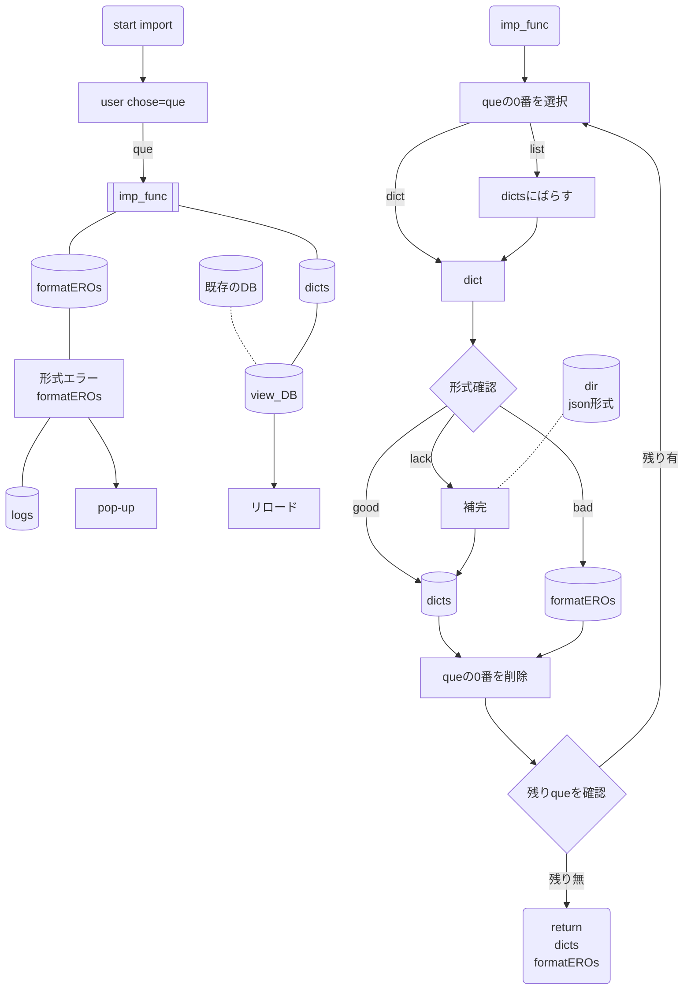

# Nango.memo

## db処理

### import時
* idはそのまま使用せず、単語の順番として扱う。
	* 読み込み後にimportした単語のidを設定
### 重複dataの処理
#### 内容の比較
->完全一致は無視。
　差分については、追加を採択。
　競合する内容はユーザーが確認。

	1. 重複とは単語名が同じもの(ただし外来語はスペルで判定。)
	2. meaning,other tagsなどのリストは競合でなければ追加。
	3. そのほかはユーザーが確認。

### ユーザー編集機能

	* 意味単位での削除機能を実装(競合処理の補助)

### 保存形式
	Name = `NangoDB_project-version`
