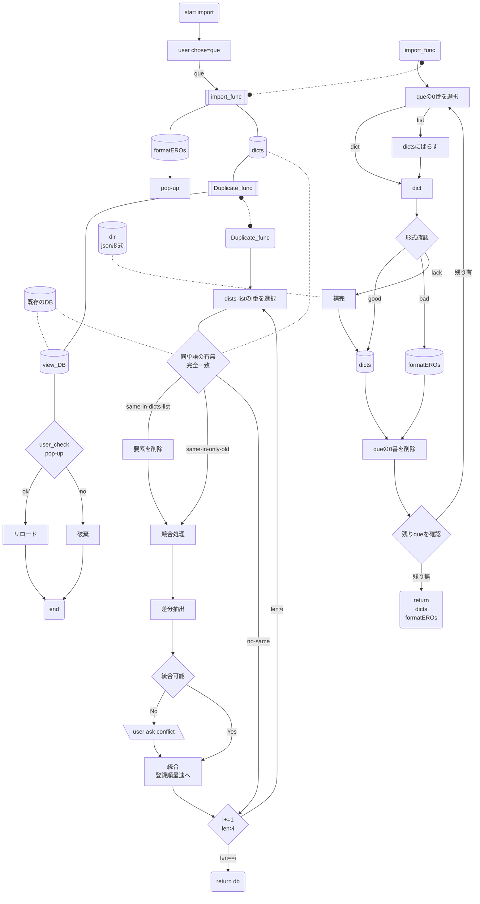

# Nango.memo

## db処理
### 保存方法（検討）
1. 保存、上書き保存の形態で保存(ユーザーがファイルを選択)  
   とりまこれ
2. ローカルでサーバーを立てる。
	* javascript
	* python
### **import process**

#### memo
* idはそのまま使用せず、単語の順番として扱う。
	* 読み込み後にimportした単語のidを設定
### 重複dataの処理
#### 内容の比較
->完全一致は無視。  
　**とりあえず、項目単位で完全一致以外は競合判定**
　差分については、追加を採択。  
　競合する内容はユーザーが確認。  
1. 重複とは単語名が同じもの(ただし外来語はスペルで判定。)
2. meaning,other tagsなどのリストは競合でなければ追加。
3. そのほかはユーザーが確認。

#### someday
*  format ERRORのpop-upからの形式即時修正、ユーザー主体
*  重複確認の単語、カッコ内のえいごなども・・・

### ユーザー編集機能
	* 意味単位での削除機能を実装(競合処理の補助)

### 保存形式
	Name = `NangoDB_project-version`
